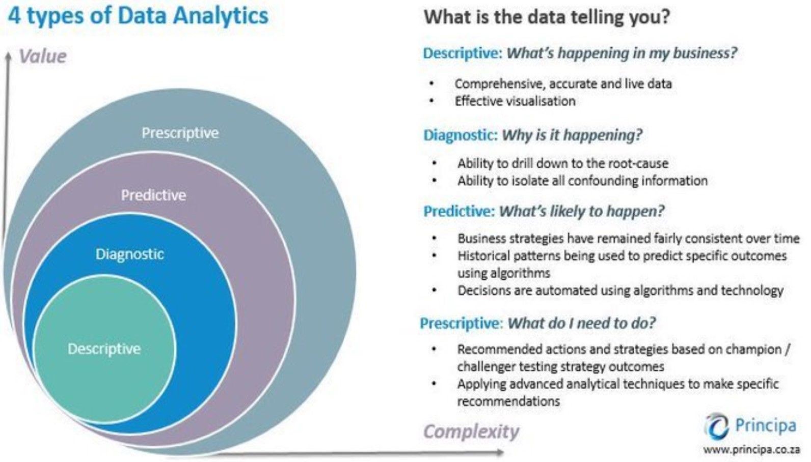

# Tipos de soluções de análise

Se dividem em 4 tipos:

## 1 Solução Descritiva

- Descreve o que **existe**;
- Olha apenas para o **passado/atual**;
- "O que aconteceu?"

## 2 Solução Diagnóstica

- Descreve os **porquês**;
- Olha apenas para o **passado/atual**;
- "**Por que isso aconteceu?**"

## 3 Solução preditiva

- Descreve o que vai existir;
- Usa o **passado** para prever/predizer o **futuro**;
    - Previsão: subconjunto da predição vinculada ao tempo
    - Predição: Forma genérica de como um fato seria antes de sua ocorrência.
- "**O que vai acontecer?**"

## 4 Solução prescritiva

- Recomenda tomada de decisões
- Usando uma predição/previsão, recomenda uma ação
- "**O que vou fazer?**"

## Resumo

