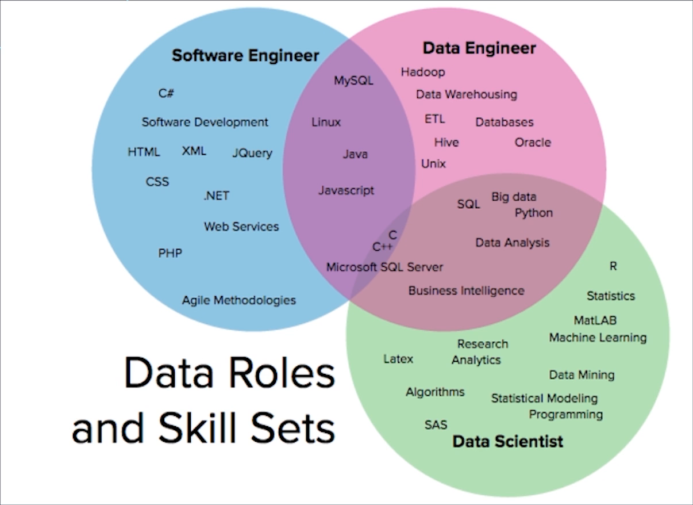
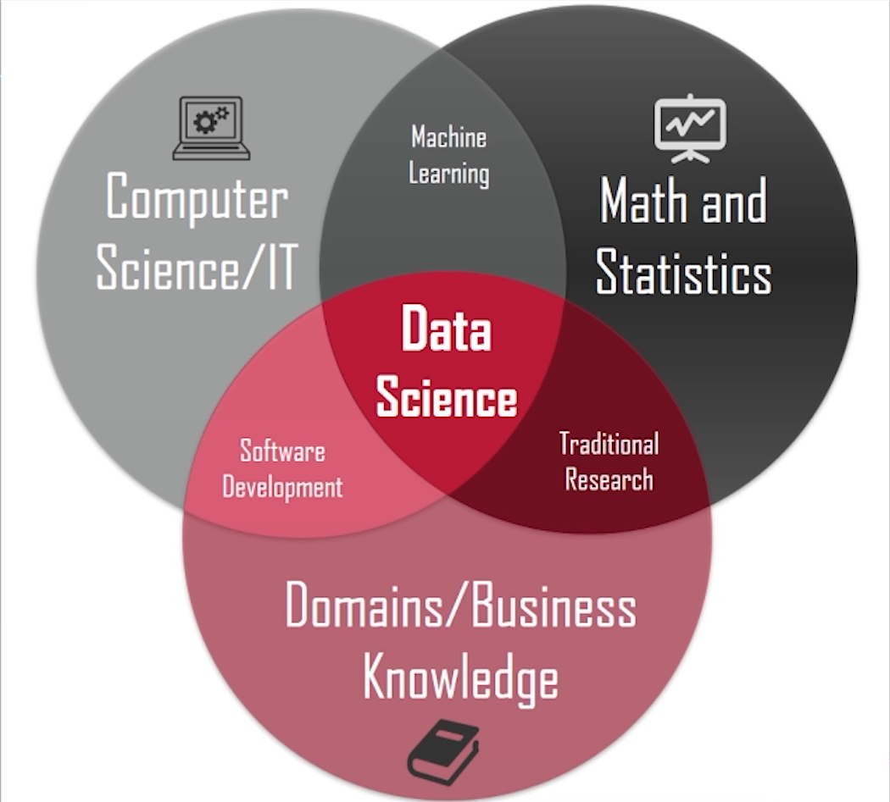

# Papéis em um Projeto de Dados

Além das pessoas envolvidas na respectiva área de negócio, temos também as carreiras de Data Sciente

- Data Scientist
- Data Architect
    - Conceber a solução de ponta a ponta, mais voltado na infra.
- Data Engineer
    - Mais focada no processo de gestão/manipulação/tranferência/ETL.
- Statistician
    - Pessoa mais focada na área estatística.
- Data Science Manager
- Machine Leraning Engineer
    - Tem skills de Data Science e desenvolvimento.
- Decision Scientists

## 3 Pilares da ciência de dados

- Matemática e estatística
- Conhecimento de negócio
- Computação/TI

