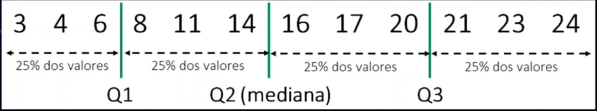
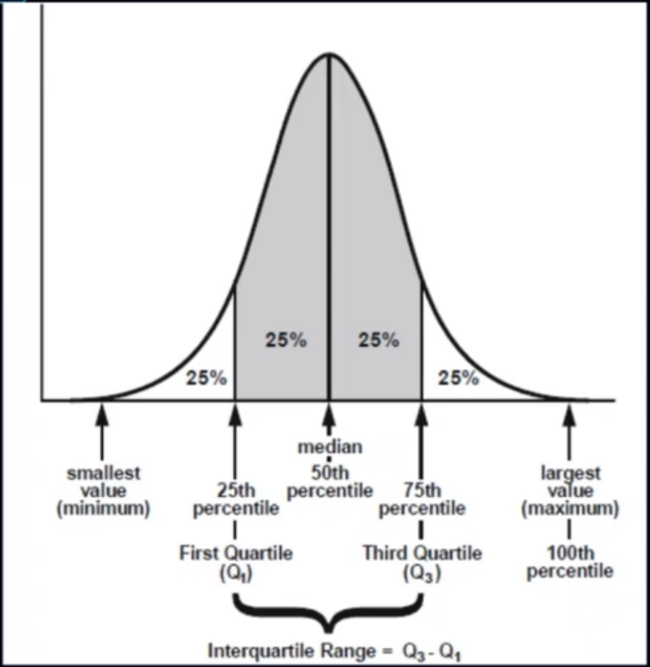
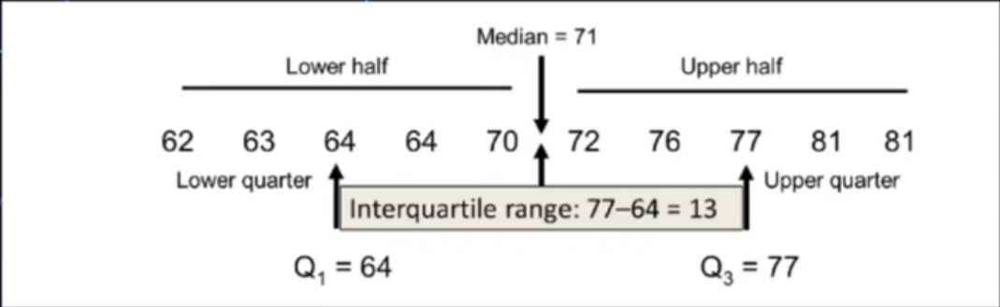
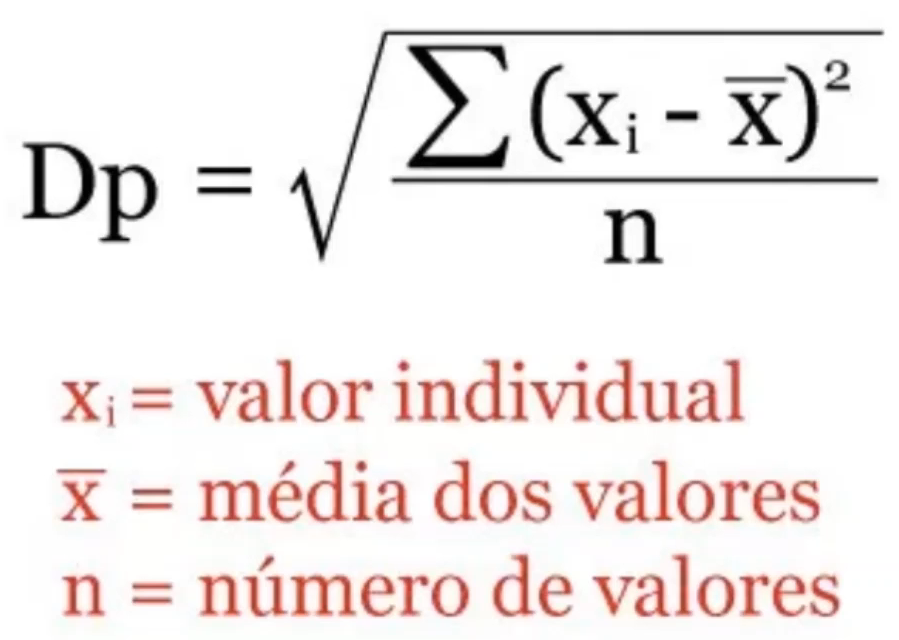
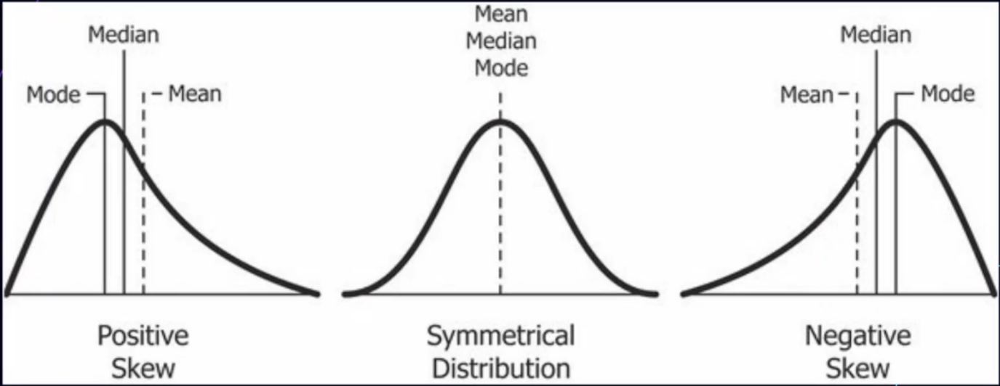

# Estatística Descritiva Univariada

## Média (*Mean* / *Average*)

Ponto central de um conjunto de informações definido pela somatória das informações de um conjunto dividido pela quantidade de informações
```
M = SUM(valores) / COUNT(valores)
```

## Mediana (*Median*)

Valor que separa a metdade das informações em **2 conjuntos de quantidades iguais**. Quando a quantidade de valores é **par**, é a **média** dos 2 valores centrais.
```
[1, 3, 3, 6, 7, 8, 9] = Mediada 6
[1, 2, 3, 4, 5, 6, 8, 9] = Mediada 4,5
```

## Percentil

- Divide os dados em **100 partes do todo**
- **1%** acumulado em cada segmento

## Quartil

- Divide os dados em **4 conjuntos de dados**
- 25% em cada conjunto

### Representação gráfica do quartil


### Amplitude interquartil (*InterQuartile Range (IRQ)*)

O 50% central dos valores quando ordenados do menor para o maior

- Encontra-se a mediana (valor do meio) **da menor e da maior metade dos dados.**
- São o **quartil 1 (Q1)** e o **quartil 3 (Q3)**. A amplitude interquartil é a **diferença entre Q3 e Q1**



Exemplo de cálculo


## Desvio padrão (*standard deviation-std*)

- Medida que expressa o **grau de dispersão de um conjunto de dados**
- Indica o quanto um conjunto de dados é uniforme
- Quanto mais próximo de 0 for o desvio padrão, mais homogêneos são os dados



Ou em código
```
sqrt((sum(x - mean(X)))**2/len(X))
```

## Assimetria (*skewness*)

- É o grau de distorção da curva simétrica a distribuição normal
- Ele mede a falta de simetria na distribuição de dados
- Diferencia valores extremos em uma cauda versus na outra
- Uma distribuição simétrica terá assimetria de 0



## Curtose (*kurtosis*)

Curtose é uma medida de dispersão que caracteriza o "achatamento" da curva da função de distribuição, elas se categorizam em:

- Mesócurticas (0)
    - Achatamento da distribuição normal
- Leptocúrticas (> 0):
    - Possui a curva da função de distribuição mais afunilada
    - Pico mais alto do que a distribuição normal
    - Possui caudas pesadas
- Platicúrtica (< 0):
    - Função de distribuição é mais achatada do que a distribuição normal

## Normalização e Padronização

- Transformar todas as variáveis na mesma ordem de grandeza
- Padronizar as variáveis irá resultar em uma média = 0, e um desvio padrão = 1.
- Normalizar tem como objetivo colocar as variáveis dentro do intervalo de 0 e 1, caso tenha valor negativo -1 e 1