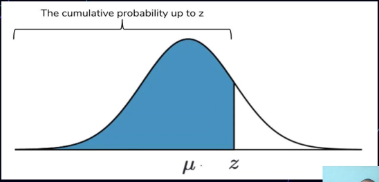

# PDF e CDF

Funções de probabilidade

## Função Densidade de Probabilidade (PDF)

- Descreve a probabilidade relativa de uma variável aleatória tomar um valor dado
- É sempre **não negativa**
- Sua integral sobre todo o espaço é igual a 1
- Informa a probabilidade de a variável X assumir um valor naquele intervalo

## Função Distribuição Acumulada (CDF)

- Descreve a probabilidade **acumulada** de uma variável aleatória tomar um **conjunto de valores** dado;
- É sempre **não negativa**
- Sua integral sobre todo o espaço é igual a 1
- Informa a probabilidade de a variável X assumir um valor naquele intervalo

## Survival Function

1 - CDF

## Função Distribuição Acumulada Empírica (ECDF)

- Um estimador da função de distribuição cumulativa
- Modelo **EMPÍRICO**
- **Funciona com suas observações**