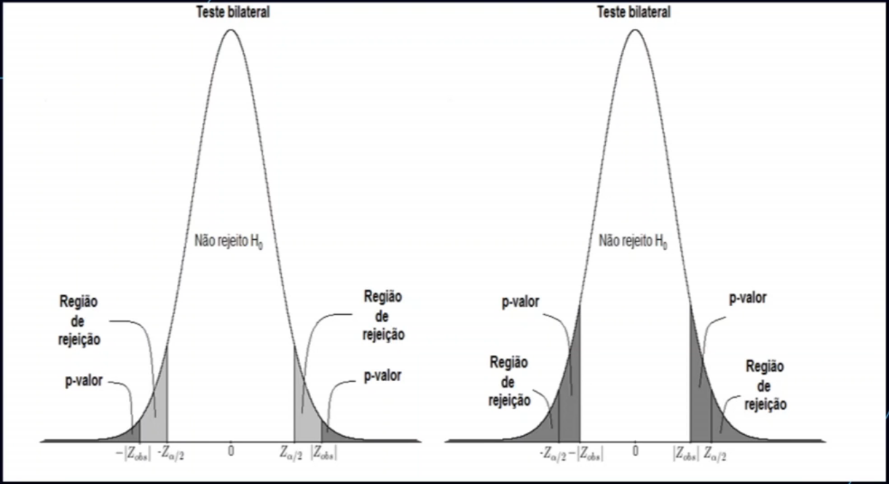

# Valor P

- Probabilidade de obter uma estatística de teste igual ou maior que a observada em uma amostra para **H0 (hipótese nula)**;
- Quanto **menor o valor de p**, maior a chance de se rejeitar a hipótese nula;
- Define-se *alpha* **antes** do experimento!!! (p-value hacking)

### Janelas do P valor

- 0 -> 0.03 Altamente significante
- 0.04 -> 0.5 Significante
- 0.051 -> 0.06 Quase significante
- o.06 -> 0.10 Altamente sugestivo
- \> 0.10 Análise de subgrupo