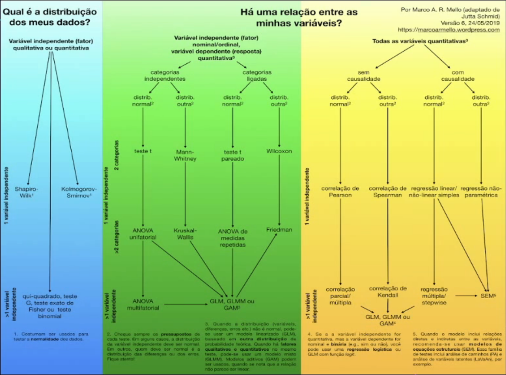

# Tipos de teste

## T-teste (Student T-test)

Baseia-se na distribuição t de Student
- Distribuição simétrica
- Semelhante à curva normal
- Grau de liberdade

## Shapiro-Wilk
- Teste de Normalidade
    - Utiliza uma amostra de uma população para validar se a mesma está **distribuída normalmente**
    - Calcular a probabilidade usando essa distribuição normal
- Variância, média e desvio padrão
- H0: Amostra provém de uma norml
- H1: Amostra não provém de uma normal
- **Não funciona muito bem com mais de 5000 observações**

## Jarque-Bera

- Teste de normalidade
    - Validar se existe desvio padrão
- Curtose e Assimetria
- H0: Amostra provém de uma norml
- H1: Amostra não provém de uma normal

## Gráfico Q-Q (QQ-Plot)

- Gráfico de Quantil-Quantil (Quartil-Quartil)
- Compara a dsitribuição de duas probabilidades
    - Entre duas variáveis
    - Entre uma variável e "quartis teóricos"
- Ajuda a validar se uma distribuição é normal

# Qual teste devo usar?
